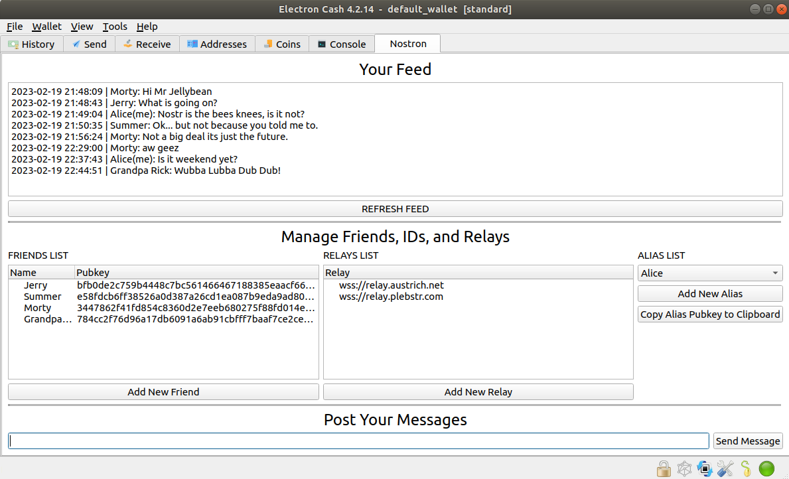

# Nostron 

Nostron is a plugin for the Electron-Cash BCH wallet.  It is a prototype minimal nostr implementation, implementing Nostr NIP-01. It uses the [monstr_terminal](https://github.com/monty888/monstr_terminal) python library for its tooling.

# What is Nostr?

In simple terms, 	[a decentralized social network with a chance of working](https://www.nostr.com).  It's a simple, open protocol that enables a truly censorship-resistant and global social network.

# How to Install and Run

Then, install the plugin by downloading the [zip file](https://github.com/Electron-Cash/Nostron/blob/main/nostron_plugin.zip), then upload that zipfile to the wallet as follows:  From the top menu, go to Tools--> Installed Plugins. This will open the plugin manager window.  Click "Add plugin" , choose the file from your computer.  Then, check the disclaimer boxes and click Install.

*for users running from python source code: First install the python dependencies in 
https://github.com/Electron-Cash/Nostron/blob/main/nostron_plugin/monstr_terminal/requirements.txt with pip install -r requirements.txt*

# How to Use

Nostron performs 2 basic functions (posting to relays and fetching from relays), and manages 3 basic sets of data (Friends, Aliases, and Relays).

1. To start, click *Add New Alias* and fill in a name (e.g. Alice). Leave the privkey field blank unless you want to import a key from another nostr client. 

2. Click *Add New Relay* and fill in a nostr relay (such as wss://relay.plebstr.com or use one your friends are using)

3. Click *Add New Friend* and fill in your friend's name (e.g. Bob).  Enter their pubkey that they use for nostr.  If you want to share your own pubkey, you can click "Copy Alias Pubkey to Clipboard".

4. Make a post by entering text into the text bar at the bottom of the app window and click "Send Message".

5. You can view your own posts and your friends' posts by clicking "Refresh Feed".

# Known Issues

1. Nostron does only a reasonable job dealing with bad relays when posting and listening.  Hopefully, a bad relay won't cause the whole app to crash, but you may get mixed results in terms of not all posts or queries may happen consistently on all relays -- for example, if the relay is overloaded, it may not respond in time.

2. Nostron should probably use waiting dialogs or other UI interaction to prevent the user from clicking too many times when a network call is being made. Be gentle and wait 10 seconds after posting or refreshing the feed. (When you make a post, the text will intentionally vanish from the input bar when the posting is complete.)

3. Nostron does not gracefully handle having multiple wallet files open at once.  Please only use it with a single wallet file open at a time.

4. The plugin currently only works if you're running Electron Cash from source code because not all the dependencies could be packaged easily.

# Roadmap

Nostron only implements the minimal features, but the nostr protocol is rich, including support of encrypted direct messages. Future development depends on community input, involvement and interest.
